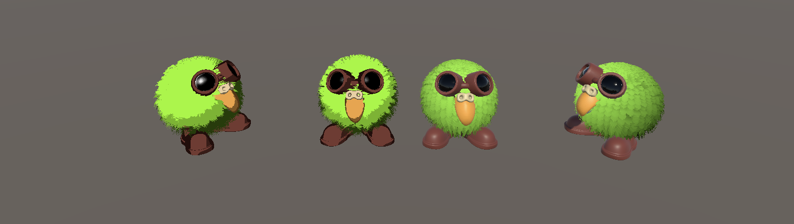

# Shader graphics and VFX - HLSL in Unity

🚧 This is a work in progress, aiming to have a playground to explore computer graphics algorithms that focus on HLSL 🚧

## Some shading results

 </br>
<span>Unity default meshes and the Stanford Bunny shaded with the Blinn-Phong shading model using HSLS</span>
 </br>
<span>Shell texture technique combined with my interpretation of the Cartoon Shade (Lake et al. 2000)</span>
 </br>
<span>Shell texture with and without toon shading </span>

## Backlog
- [ ] Come up with a solution for Silhouette Edge Detection on shell texturing because the traditional one creates artifacts.
- [ ] Expose parameters to change the threshold of the Cartoon shades
- [ ] Expose parameters to change the color of the Silhouette

## Material and light math

1. **Lambert Diffuse (Diffuse Shading)**
  
     $$I_{\text{diffuse}} = \text{max}(0, <\mathbf{L} \cdot \mathbf{N}>) * C_{\text{light}} * C_{\text{surface}}$$

     - $$\(\mathbf{L}\)$$ is the light direction.
     - $$\(\mathbf{N}\)$$ is the normalized surface normal in *world space*.
     - $$\(C_{\text{light}}\)$$ is the color of the light.
     - $$\(C_{\text{surface}}\)$$ is the surface base color (albedo).
     - The Lambertian term $$\(\mathbf{L} \cdot \mathbf{N}\)$$ computes how much light hits the surface, and `max(0, ...)` ensures no negative values for the dot product.


2. **Ambient Light**

     $$I_{\text{ambient}} = C_{\text{ambient}} \cdot C_{\text{surface}} \cdot k_{\text{ambient}}$$
     - $$\(C_{\text{ambient}}\)$$ is the ambient light color.
     - $$\(C_{\text{surface}}\)$$ is the surface base color.
     - $$\(k_{\text{ambient}}\)$$ is the ambient light intensity coefficient.
     - This term accounts for light present everywhere, simulating indirect illumination.

3. **Blinn-Phong Specular Lighting**

     $$I_{\text{specular}} = k_{\text{specular}} \cdot \left( \text{max}(0, \mathbf{H} \cdot \mathbf{N}) \right)^{\alpha}$$
     - $$\(k_{\text{specular}}\)$$ is the specular coefficient (color or intensity).
     - $$\(\mathbf{H}\)$$ is the half-vector, calculated as the normalized sum of the view direction *(eye)* $$\(\mathbf{V}\)$$ and light direction $$\(\mathbf{L}\)$$.
     - Note that the view direction is computed by the position of the fragment in world space, obtained on the vertex shader `GetVertexPositionInputs(input.vertex.xyz).positionWS;`
     - $$\(\mathbf{N}\)$$ is the surface normal.
     - $$\(\alpha\)$$ is the shininess or glossiness exponent.
     - This term models the shininess or highlights from reflected light, with the intensity controlled by the shininess factor.

4. **Blinn-Phong Shader**

     $$I_{\text{total}} = I_{\text{diffuse}} + I_{\text{specular}} + I_{\text{ambient}}$$
     - Combines the diffuse, specular, and ambient terms to compute the final color seen on the surface.
     - This models a surface affected by direct lighting, shininess, and ambient lighting for more realistic shading.

## Shading modes cheat-sheet

“Lambertian shading is view independent: the color of a surface does not depend on the direction from which you look.” ([“Fundamentals of Computer Graphics, Fourth Edition”, p. 82](zotero://select/library/items/L7XG5IT7)) ([pdf](zotero://open-pdf/library/items/TDYJ9I4M?page=97))

``` C
VertexNormalInputs normals = GetVertexNormalInputs(input.normal.xyz);
float3 worldNormal = normals.normalWS.xyz; 


float intensity = max(0, dot(light.direction, worldNormal /*N*/)); // < 0 ? 0 : dot(light.direction, input.normal) ;

float4 lambertianColor = float4(surfaceColor.xyz, 1) * float4(light.color.xyz, 1) * intensity;

float ambientLightIntensity = 0.05;
float4 ambientColor = surfaceColor * ambientLightIntensity;

float4 colorWithAmbient = lambertianColor + ambientColor;
```
## References

[1] A. Lake, C. Marshall, M. Harris, and M. Blackstein, “Stylized rendering techniques for scalable real-time 3D animation,” in Proceedings of the 1st international symposium on Non-photorealistic animation and rendering, in NPAR ’00. New York, NY, USA: Association for Computing Machinery, Jun. 2000, pp. 13–20. doi: 10.1145/340916.340918.

- [Unity HLSL](https://github.com/Unity-Technologies/Graphics/blob/master/Packages/com.unity.render-pipelines.universal/ShaderLibrary/Core.hlsl)

- [HLSL variables functions](https://github.com/Unity-Technologies/Graphics/blob/master/Packages/com.unity.render-pipelines.universal/ShaderLibrary/ShaderVariablesFunctions.hlsl)

