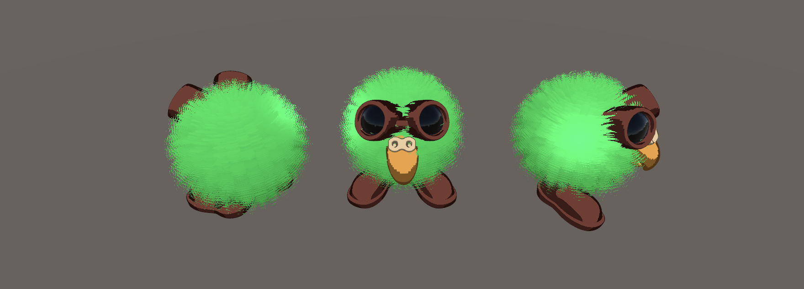
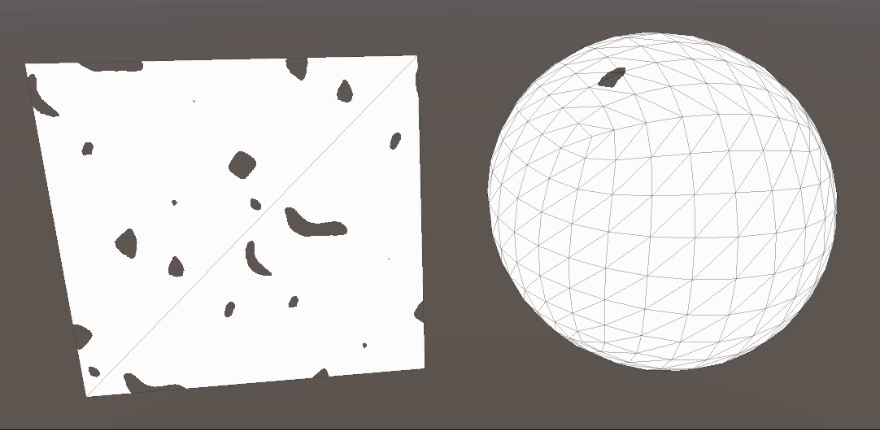
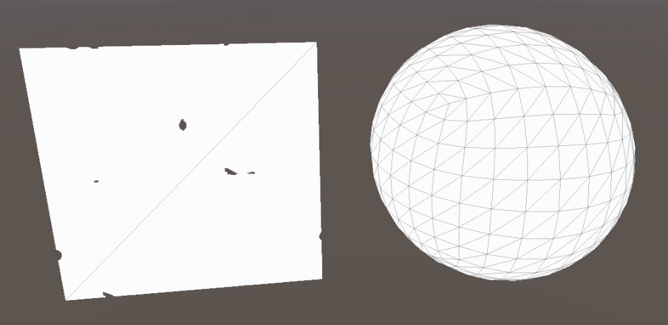

# Non-Photorealistic Rendering (NPR)

## Half lambert



---
## Session 2024-10-31: Fake "Volumetric" fire shader with erossion shader

Obejctive: Review Simon Trümpler shader analisis of [Stylized fire with smoke in RiME](https://youtu.be/ExD_p3hsV80?si=p3mjSJeaOJR7Q7K-), and implement a simple version ans answer.

- What are the fundamental principles in this method? What makes so compelling?
- What is the algorithm?

*The mesh and vertex distribution of the sphere needs to be regular

Steps:
- Base lambert
- Emissive
- Deform
- Alpha erosion

``` HLSL
float frecuency = _Time * 100;
float reMappedFrecuency = (1.05 - sin(frecuency)) * 0.5;
float alphaThreshold = reMappedFrecuency * reMappedFrecuency;
if(erosionSample.r < alphaThreshold)
    pixelColor.a = 0.0;
```
Linear frecuency


Squared frecuency


Unclear things:
- If Alpha values don't fade, recall that in raterization, the alpha needs to have a blending function to determine how it will behave with the background color (or any color that is behind that fragment).
- I tried to offset the vertices on the vert by sampling the texture, but did not work

```HLSL
fragmentOutput.uv = TRANSFORM_TEX(meshInput.uv, _ErosionMap);
float4 erosionSample = SAMPLE_TEXTURE2D(_ErosionMap, sampler_ErosionMap, fragmentOutput.uv);
meshInput.vertex.xyz += meshInput.normal * (float)erosionSample.x * _DeformCoefficient;
```

TODO:
- Study [blending modes](https://docs.unity3d.com/Manual/SL-Blend.html) in more depth

Next:
- Study Vertex Displacement based on a texture
- Apply emissive material
- Combine erosion with displacement and emissive
