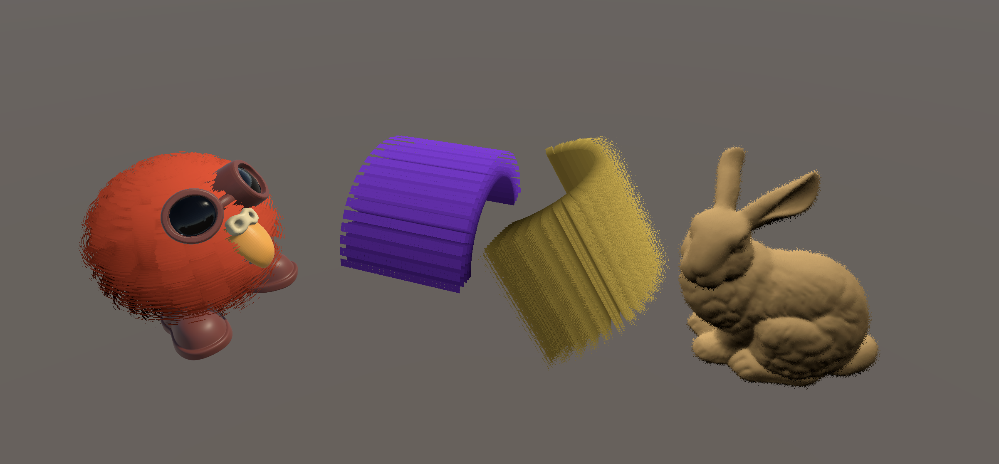

# Shell texture

Shell texturing is a well-known method for simulating the appearance of volumetric fur or similar layered effects on arbitrary 3D surfaces. It was originally developed by Jerome Lengyel at Microsoft Research in 2000. I based my implementation on Garrett Gunnell's (also known as Acerola) simplified shell texturing version for Unity.

In practice, shell texturing involves duplicating a 3D mesh multiple times to form concentric "shells." Each duplicate is scaled outward along the vertex normals at different steps to create a layered structure around the model. A noise or fur texture is sampled on each shell, and by applying an alpha threshold, parts of the outer shells are discarded, giving the impression of fur strands. This alpha clipping effect mimics the visual density of fur by reducing coverage in each shell, so only a limited number of textured pixels remain visible on most external layers. This creates the illusion of soft fur from a distance.

While effective and performant, this technique suffers from artifacts along the model's silhouette, where the separation between shells can become visible at glancing angles.
